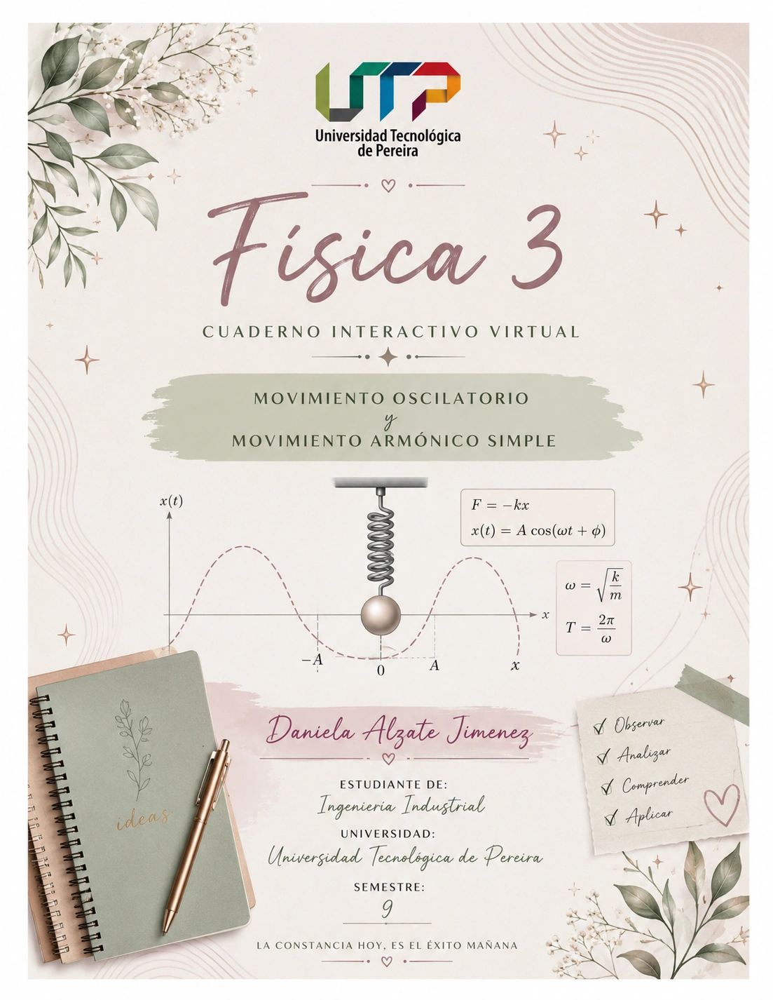

# ⚛️ Cuaderno Digital de Física III • Movimiento Oscilatorio y M.A.S.

[](https://developer.mozilla.org/es/docs/Web/HTML)
[](https://developer.mozilla.org/es/docs/Web/CSS)
[](https://developer.mozilla.org/es/docs/Web/JavaScript)
[](https://katex.org/)
[](https://web.dev/progressive-web-apps/)
[](LICENSE)

> **Cuaderno Académico Digital Interactivo de Física III**, enfocado en el **Movimiento Oscilatorio** y el **Movimiento Armónico Simple (M.A.S.)**. Integra demostraciones analíticas rigurosas, simuladores dinámicos a 60 FPS, graficador cartesiano estilo GeoGebra y ejercicios resueltos bajo una metodología pedagógica estricta en 5 pasos.

---

## 📸 Vista Previa

<div align="center">
  
  <p><em>Portada editorial realista del cuaderno digital con estética de anillas espiral y papel cálido.</em></p>
</div>

---

## 🌟 Características Destacadas

### 📖 1. Experiencia Esqueumórfica & Editorial de Alta Precisión
- **Diseño tipo cuaderno de anillas**: Espiral metálica realista, páginas texturizadas en papel cálido milimetrado y tipografía editorial optimizada.
- **Navegación fluida**: Transiciones de cambio de página, compatibilidad con gestos táctiles (*swipe*) en móviles/tablets, atajos de teclado y selector directo de páginas.
- **Modo Pantalla Completa**: Para proyecciones en aula, conferencias o estudio inmersivo.

### 📐 2. Laboratorio Cartesiano Estilo GeoGebra
- **Motor gráfico interactivo sobre HTML5 Canvas**:
  - Cuadrícula milimetrada cartesiana dinámica con ejes rotulados y calibración automática.
  - Paneo interactivo (*drag & pan*) y zoom con rueda del ratón o botones.
  - Re-escalado independiente de ejes ($X$ en segundos, $Y$ en metros, $\text{m/s}$ o $\text{m/s}^2$).
  - Trazado simultáneo o selectivo de las tres funciones armónicas: **Posición $x(t)$**, **Velocidad $v(t)$** y **Aceleración $a(t)$**.
  - Inspector de coordenadas en tiempo real al pasar el cursor sobre cualquier punto de la curva.
  - Personalizador cromático y de estilos de trazo (sólido, discontinuo, punteado).

### ⚙️ 3. Simulador Físico Premium (Masa-Resorte & Fasor a 60 FPS)
- **Oscilador Armónico en Tiempo Real**:
  - Resorte helicoidal elástico deformable con trazado realista de espiras.
  - Bloque oscilante con vectores dinámicos de **Fuerza Restauradora** ($\vec{F}$) y **Velocidad** ($\vec{v}$).
  - **Fasor rotante sincronizado**: Representación geométrica en el plano complejo de amplitud $A$ y velocidad angular $\omega$.
  - **Diagrama de barras de energía mecánica en vivo**: Balance instantáneo entre Energía Cinética ($E_k$), Energía Potencial Elástica ($E_p$) y Energía Mecánica Total ($E_m = \text{constante}$).
  - Panel de control paramétrico: Masa ($m$), Constante elástica ($k$), Amplitud ($A$), Amortiguamiento ($\gamma$), escala temporal y pausa/reanudación.

### 🧠 4. Mapa Mental Interactivo
- Grafo conceptual interactivo renderizado en Canvas con nodos navegables.
- Conecta conceptos clave: Movimiento Periódico, Frecuencia, Ley de Hooke, E.D.O., Conservación Energética y Fasores.
- Tarjeta informativa lateral que despliega la definición y relaciones al hacer clic o posarse sobre cualquier nodo.

### 🧮 5. Metodología Pedagógica Estricta en 5 Pasos & Calculadoras Interactivas
Los problemas resueltos implementan un código cromático y metodológico riguroso:
1. <span style="color:#2563eb; font-weight:bold;">Paso 1 (Azul):</span> **Identificación de Datos** del enunciado.
2. <span style="color:#dc2626; font-weight:bold;">Paso 2 (Rojo):</span> **Declaración de Incógnitas** a determinar.
3. <span style="color:#1e3a8a; font-weight:bold;">Paso 3:</span> **Selección de Principios y Fórmulas Físicas**.
4. <span style="color:#d97706; font-weight:bold;">Paso 4 (Naranja):</span> **Despeje Analítico y Sustitución Numérica**.
5. <span style="color:#059669; font-weight:bold;">Paso 5 (Verde):</span> **Conclusiones Físicas y Validación de Unidades SI**.
- **Calculadoras de comprobación**: Permiten alterar los parámetros de entrada ($m$, $k$, $A$, $t$, $\phi$) para verificar numéricamente los resultados de inmediato.

### 📱 6. Progressive Web App (PWA) & Modo Offline
- Equipado con `manifest.json` y `sw.js` (Service Worker).
- Permite instalar la aplicación en computadores (Chrome, Edge) y teléfonos móviles como si fuera una aplicación nativa.
- Funciona sin conexión a internet tras la primera carga.

---

## 📑 Estructura Modular del Cuaderno

El cuaderno está organizado en **11 módulos secuenciales** (Páginas 0 a 10):

| Página | Título del Módulo | Temáticas & Contenidos Clave |
| :---: | :--- | :--- |
| **0** | **Portada Oficial** | Carátula editorial con anillas, título de la asignatura y créditos de autoría. |
| **1** | **Índice & Equipo** | Estructura curricular interactiva y presentación del equipo multidisciplinar. |
| **2** | **Reseña Histórica** | Línea de tiempo interactiva: de Galileo (1581) a Fourier (1822). |
| **3** | **Mapa Mental** | Red conceptual interactiva de magnitudes periódicas, cinemáticas y dinámicas. |
| **4** | **Conceptos Fundamentales** | Movimiento oscilatorio vs. periódico, elongación, amplitud, período y frecuencia SI. |
| **5** | **M.A.S. & E.D.O.** | Ley de Hooke, 2ª Ley de Newton y deducción paso a paso de $\frac{d^2x}{dt^2} + \omega^2 x = 0$. |
| **6** | **Cinemática & Energía** | Ecuaciones de $x(t)$, $v(t)$, $a(t)$, desfasajes, fasores y conservación de energía. |
| **7** | **Laboratorio GeoGebra** | Graficador cartesiano interactivo milimetrado con zoom, pan y escalas libres. |
| **8** | **Simulador Dinámico** | Sistema masa-resorte a 60 FPS, vectores de fuerza/velocidad y balance energético. |
| **9** | **Ejercicios Resueltos** | Metodología de 5 pasos con calculadoras reactivas para comprobación inmediata. |
| **10** | **Glosario & APA 7** | Fichas terminológicas clave y referencias bibliográficas en formato APA 7ma edición. |

---

## 💻 Tecnologías Utilizadas

- **Arquitectura**: Single Page Application (SPA) / Progressive Web App (PWA).
- **Estructura & Semántica**: HTML5 con etiquetas accesibles y estructuradas.
- **Estilos & Diseño Visual**: CSS3 nativo avanzado (CSS Variables, Flexbox, Grid, sombras multicapa, diseño responsivo).
- **Lógica & Motores**: JavaScript (ES6+) con Programación Orientada a Objetos (POO):
  - `HTML5 Canvas API` para renderizado gráfico ultrarrápido a 60 cuadros por segundo.
  - `requestAnimationFrame` para animaciones físicas de alta tasa de refresco sin consumo excesivo de CPU.
- **Librerías Externas (vía CDN seguro)**:
  - [KaTeX 0.16.11](https://katex.org/): Renderizado tipográfico matemático de fórmulas $\LaTeX$ de máximo rendimiento.
  - [Nerdamer.js](https://nerdamer.com/): Motor de álgebra computacional simbólica para validación de ecuaciones.
  - [Lucide Icons](https://lucide.dev/): Iconografía vectorial limpia y moderna.

---

## 📂 Estructura del Repositorio

```plaintext
fisica-3-cuaderno-digital/
│
├── index.html                   # Documento principal SPA con las 11 páginas del cuaderno
├── manifest.json                # Manifiesto de la aplicación web (PWA)
├── sw.js                        # Service Worker para almacenamiento en caché y uso offline
├── README.md                    # Documentación completa del proyecto
│
├── css/
│   ├── main.css                 # Estilos globales, tipografías y variables de diseño
│   ├── notebook.css             # Estructura del cuaderno, anillas espirales y hojas
│   ├── geogebra.css             # Estilos del laboratorio gráfico estilo GeoGebra
│   └── components.css           # Botones, tarjetas, calculadoras, tablas y widgets
│
├── js/
│   ├── app.js                   # Controlador principal, navegación, teclado y eventos PWA
│   ├── geogebra-canvas.js       # Motor gráfico cartesiano interactivo estilo GeoGebra
│   ├── physics-simulation.js    # Motor de simulación física del oscilador masa-resorte
│   ├── mindmap.js               # Renderizador y controlador del mapa mental interactivo
│   └── exercises.js             # Gestor de ejercicios resueltos y calculadoras dinámicas
│
└── imagenes/
    ├── portada.webp             # Carátula oficial del cuaderno en formato optimizado WebP
    ├── portada.png              # Imagen de portada en alta resolución (fuente)
    ├── hoja_contenido.webp      # Textura de papel para las páginas interiores
    └── hoja_contenido.png       # Textura de hoja en alta resolución (fuente)
```

---

## 🚀 Cómo Ejecutar el Proyecto Localmente

No se requiere instalar entornos pesados de compilación ni dependencias de Node.js. Al ser una aplicación web estandarizada, puedes ejecutarla directamente:

### Opción 1: Abrir directamente
1. Clona o descarga este repositorio en tu computadora.
2. Haz doble clic en el archivo `index.html` para abrirlo en cualquier navegador web moderno (Google Chrome, Mozilla Firefox, Microsoft Edge, Safari, Opera).

### Opción 2: Usar un Servidor Local (Recomendado para PWA y Service Worker)
Para que el Service Worker (`sw.js`) y las capacidades offline operen con todas sus funciones de seguridad:

- **Con la extensión Live Server de VS Code**:
  - Abre la carpeta del proyecto en Visual Studio Code.
  - Haz clic derecho sobre `index.html` y selecciona **"Open with Live Server"**.

- **Con Python (instalado por defecto en la mayoría de sistemas)**:
  ```bash
  # Abre la terminal en la carpeta del proyecto y ejecuta:
  python -m http.server 8000
  ```
  Luego ingresa a `http://localhost:8000` en tu navegador.

- **Con Node.js (npx serve)**:
  ```bash
  npx serve .
  ```

---

## 🌐 Cómo Publicar Gratis en GitHub Pages

Puedes desplegar este cuaderno para que cualquier persona en el mundo pueda usarlo en línea gratis siguiendo estos sencillos pasos:

1. Sube este repositorio a tu cuenta de GitHub.
2. En GitHub, dirígete a la pestaña **Settings** (Configuración) de tu repositorio.
3. En el menú lateral izquierdo, haz clic en **Pages**.
4. En la sección **Build and deployment**:
   - **Source**: Selecciona `Deploy from a branch`.
   - **Branch**: Selecciona `main` (o `master`) y la carpeta `/ (root)`.
5. Haz clic en **Save**.
6. En un par de minutos, GitHub te proporcionará el enlace público (por ejemplo: `https://tu-usuario.github.io/fisica-3/`).

---

## 📤 Instrucciones para Subir este Proyecto a GitHub

Si aún no has vinculado tu carpeta local a un repositorio de GitHub, ejecuta los siguientes comandos en tu terminal (Git Bash, PowerShell o CMD):

```bash
# 1. Abre la terminal en la carpeta del proyecto:
cd "c:\Users\dalza\Desktop\fisica 3"

# 2. Inicializa el repositorio de Git:
git init

# 3. Agrega todos los archivos al seguimiento:
git add .

# 4. Realiza tu primer commit:
git commit -m "feat: publicación inicial del Cuaderno Digital de Física III (M.A.S.)"

# 5. Renombra la rama principal a 'main':
git branch -M main

# 6. Conecta con tu repositorio remoto de GitHub (sustituye con tu URL):
git remote add origin https://github.com/TU_USUARIO/TU_REPOSITORIO.git

# 7. Sube los archivos a GitHub:
git push -u origin main
```

> **Alternativa sin comandos**: También puedes usar la aplicación gráfica [GitHub Desktop](https://desktop.github.com/) arrastrando la carpeta del proyecto y haciendo clic en **Publish repository**.

---

## 👥 Equipo de Autoras & Desarrollo

Este cuaderno interactivo fue diseñado, desarrollado y fundamentado académicamente por:

| Autora | Rol / Especialidad | Aporte Principal |
| :--- | :--- | :--- |
| **Daniela Alzate Jimenez** | Física Teórica & Matemáticas | Deducciones analíticas de las EDOs, parametrización cinemática y dimensional. |
| **Ana María López Giraldo** | Diseño Editorial & Didáctica | Diagramación de hojas, selección cromática metodológica y experiencia de usuario. |
| **María Alejandra Ramirez Montes** | Ingeniería Web & Simulación | Implementación de simuladores Canvas a 60 FPS, graficador GeoGebra y arquitectura PWA. |

---

## 📖 Referencias Bibliográficas (Normas APA 7)

- **French, A. P.** (2018). *Vibrations and waves* (1.ª ed. reimpresa). CRC Press / MIT Introductory Physics Series. https://doi.org/10.1201/9781315275680
- **Halliday, D., Resnick, R., & Walker, J.** (2018). *Fundamentals of physics: Extended* (11.ª ed.). John Wiley & Sons.
- **Pain, H. J.** (2005). *The physics of vibrations and waves* (6.ª ed.). John Wiley & Sons.
- **Sears, F. W., Zemansky, M. W., Young, H. D., & Freedman, R. A.** (2018). *Física universitaria con física moderna* (14.ª ed., Vol. 1). Pearson Educación.
- **Serway, R. A., & Jewett, J. W.** (2019). *Física para ciencias e ingeniería* (10.ª ed., Vol. 1). Cengage Learning.
- **Tipler, P. A., & Mosca, G.** (2020). *Física para la ciencia y la tecnología: Mecánica, oscilaciones y ondas* (6.ª ed., Vol. 1). Editorial Reverté.

---

## 📄 Licencia

Este proyecto se distribuye bajo la **Licencia MIT**. Siéntete libre de utilizarlo con propósitos educativos, de investigación o de estudio. Consulta el archivo de licencia para mayores detalles.
